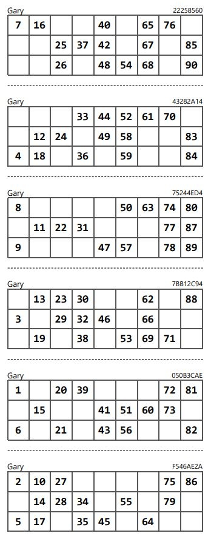

# Bingo

Initial stab at a bingo program that I started in order to:
1. Have something to do
2. Brush up on my python skills
3. Learn about micro-services design
4. Learn about service mesh
5. Learn about Tekton/ArgoCD for CI/CD development under Openshift

The idea is to have multiple micro-services running to form the bingo application.
There will be a central pod doing the bingo calling, a ticket generator pod for tickets and multiple client pods as the players.  In addition, a mysql pod backend will contain the stats (winning tickets, players name, number of balls called etc.)

Once developed I want to incorporate service mesh to run across multiple clouds

The communication messaging between nodes will use Googles RPC (see: https://grpc.io/docs/what-is-grpc/introduction/)
and is based on this as a starting point: https://realpython.com/python-microservices-grpc/

My initial thoughts after starting this project are:
1. My python skills are non existent :-(
2. Designing for micro-services and communication is not easy.
3. Im not a programmer lol.

# Bingo card generation
The bingo card generation is tricky. we will be using a standard English bingo card (for now) that has the following constraints:

- Each ticket has 3 rows with 9 cells each.
- Each ticket contains 15 numbers.
- Each row must have 5 numbers.
- Each page should have 6 tickets that account for all 90 numbers.
- Each number should only appear once per 6 tickets.
- For each column in ticket, there can be a max of 3 numbers.
- No ticket should have empty column / columns
- The numbers in every column must be sorted ascending.

A typical card looks like this:



The challenge is to get that working first.
### Links for bingo card generation

Bingo card generator (pay): https://myfreebingocards.com/bingo-card-generator/edit/y6gbar
https://github.com/delins/bingo : generates pdf 5x5 bingo card. Might be useful to print out cards. 
https://github.com/digitalsleuth/bingo-card-generator: Similar, looks to have a gui frontend.

Some theory here using conjure programming language: https://journal.artfuldev.com/generating-tickets-for-tambola-or-bingo-or-housie-or-whatever-58df409205ae

Automated number caller page: https://www.online-stopwatch.com/random-number-generators/online-bingo-caller/
and this one: https://partystuff.in/tambola-board

Here's a solution but in js I think: ```./tambola-tickets```
This look sinteresting: https://github.com/ishitajain21/Housie.git
There is a pre-defined python library for housie: https://pypi.org/project/housie/
###
G.Crowe, Apache2 License.  Knock yourself out!
